Appendix B: Semi-automated Storm Delineation Workflow
================
Dong Liang
2022-12-22

## Storm delineation method

The vignette gave an example of the R code and the manual review
process. This is an R Markdown document showing the storm delineation
process. The following codes load the scripts and a test data from
station NWIS#01589290.

``` r
rm(list=ls())
library(stormstats)
```

    ## Loading required package: zoo

    ## 
    ## Attaching package: 'zoo'

    ## The following objects are masked from 'package:base':
    ## 
    ##     as.Date, as.Date.numeric

    ## Loading required package: xts

    ## Loading required package: dygraphs

``` r
load(file="qdat.RData")
str(qdat)
```

This data set includes the regularly spaced time series of water yield,
which is flow normalized by watershed area in the unit of cubit meter
per second per square meter.

We developed an algorithm to track the yield time series, and
automatically delineate the start and end of each potential storm. The R
function $hydrograph$ implements the algorithm.

``` r
r_ <- hydrograph(qdat,verbose = FALSE)
```

The object **r\_** returns a data frame listing each storm, rising and
falling limbs, duration, and average yield.

``` r
table(r_$value$nevent)
```

    ## 
    ##   0   1   2   4 
    ## 538  64   4   1

The variable $nevent$ tracks the number of valleys in each storm event.
There were 607 storm events according to the algorithm. Among those, 538
events are estimated as mostly single peak events. Specifically, this
was defined as either a single pair of rising and falling limbs, or
multiple peaks that were relatively close (separated by at most 1 hour).
The rest (69) events were estimated to be multi-peak events.

## single peak events

We first look at events with one peak. The events can be identified as
$nevent$, the number of valleys being zero.

``` r
a_ <- subset(r_$value,nevent==0)
hist(a_$len,main="Duration",xlab="# 15-min intervals")
```

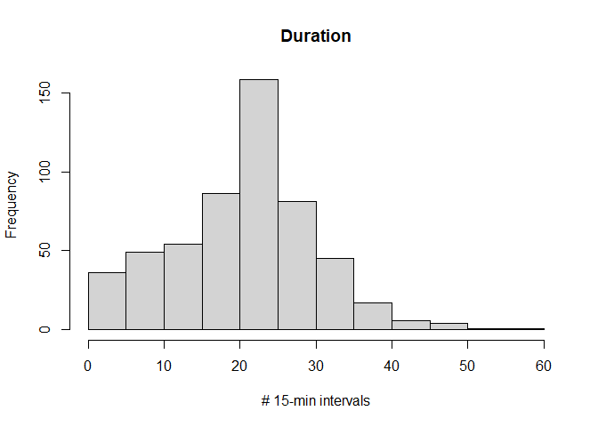<!-- -->

Most of the events are longer in duration than one hour. But there are
short storms. The following code lists those “storms” less than one hour
in duration and draws a histogram of the average yields.

``` r
a1_ <- subset(a_,len<4)
hist(a1_$q,main="Water Yield",xlab=expression("m^3/s/m^2"))
```

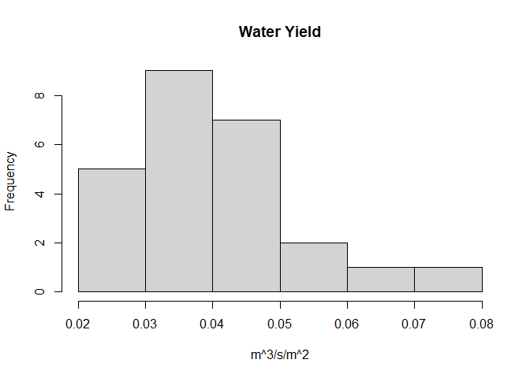<!-- -->

The storms all have small water yields, so the algorithm has picked out
minor up and down of water yield during the base-flow period, the
following is an example.

``` r
plotStorm(r_,a1_$storm[1])
```

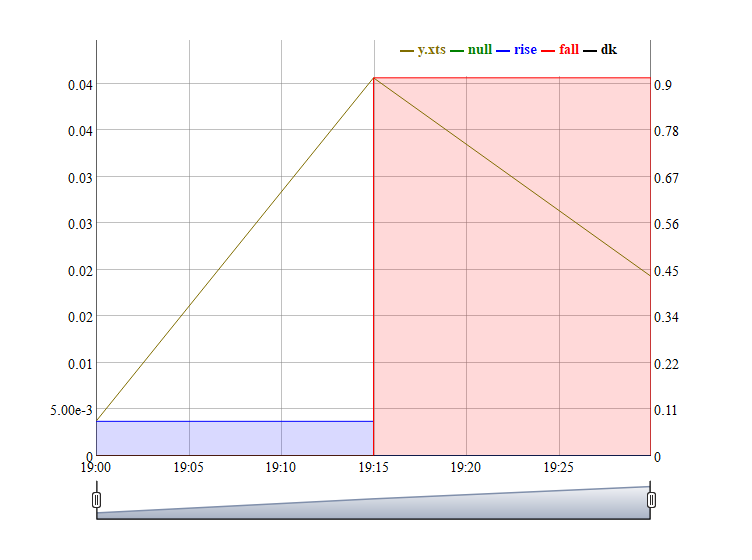<!-- --> The $plotStorm$ function
takes the output from $hydrograph$ and a storm ID and visualizes the
hydrograph for that storm. Colors were used to denote the rising and
falling limbs, as well as periods of minor fluctuations that appeared
rather flat.

A 20% sample of the single-peak events was manually reviewed to confirm
that this delineation should be as base-flow instead. The algorithm
appears too sensitive in delineating storm events.

Now we look at longer events with an average yield above 0.5.

``` r
a2_ <- subset(a_,len>4&q>0.5)
plotStorm(r_,a2_$storm[1])
```

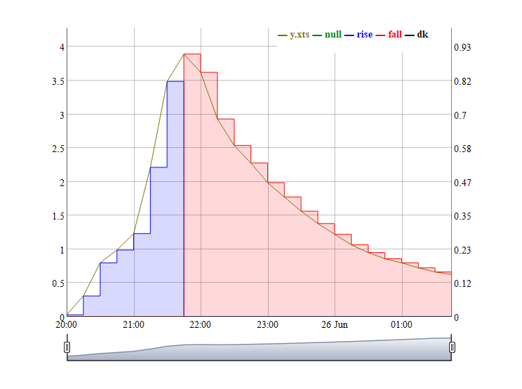<!-- --> The hydrograph shows up as
a more typical storm event. I reviewed a random sample of those storms
and identified no obvious errors in delineating these events: the
hydrographs looked like a typical storm.

## Double peak events

Now we work on events with two peaks, that is events with one valley in
the hydrograph.

``` r
b_ <- subset(r_$value,nevent==1)
```

A decision process was programmed on whether to separate these events.
The decision depended on whether the valley is deep relative to the
previous and the next peaks. The decision also depended on the slope of
the adjacent rising limbs.

The following figures show several examples. When the valley is shallow,
we don’t separate the two peaks, see an example below. In the figure
below, such a decision is shown as a dashed vertical line.

``` r
plotStorm(r_,8)
```

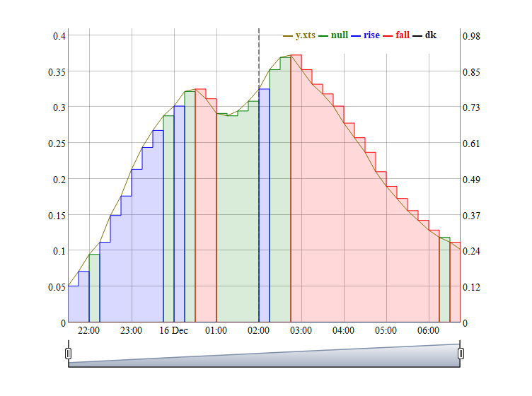<!-- -->

When the valley is shallow concerning the next peak only, the valley is
considered part of a falling limb, and we don’t separate the two peaks.
See the example below.

``` r
plotStorm(r_,16)
```

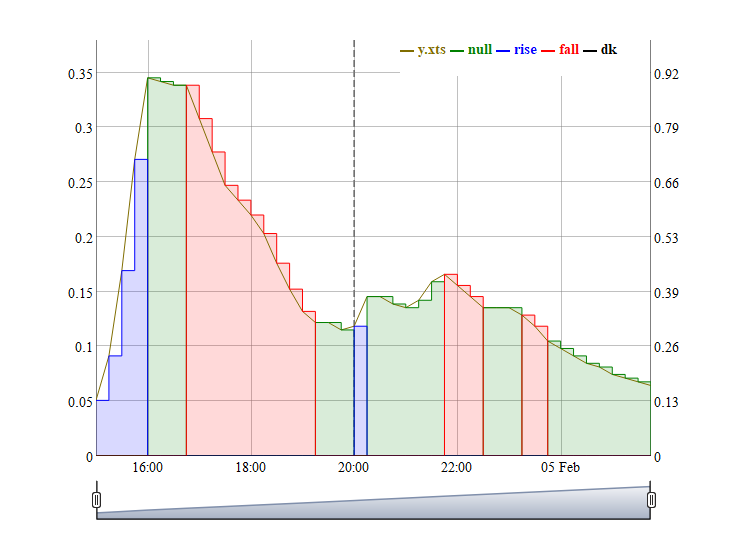<!-- -->

When the valley is shallow concerning the previous peak only, this is
considered a rising limb, if the two adjacent limbs have a similar
slope, an example follows.

``` r
plotStorm(r_,28)
```

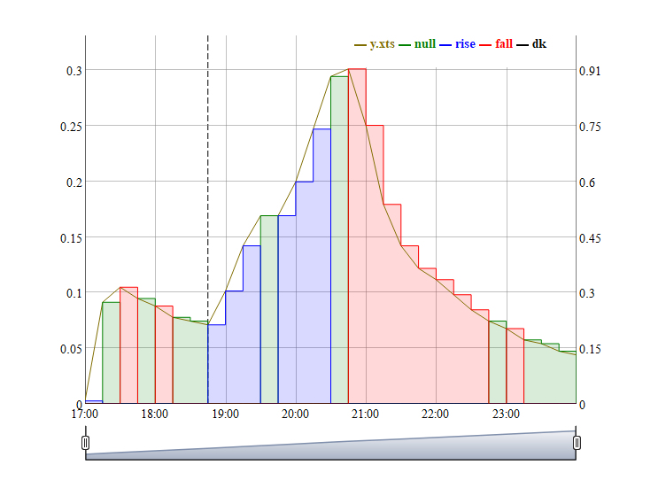<!-- -->

When the valley is shallow concerning the previous peak only, but the
rising limbs are of different slopes, we separate the two peaks and
separate events, an example follows.

``` r
plotStorm(r_,71)
```

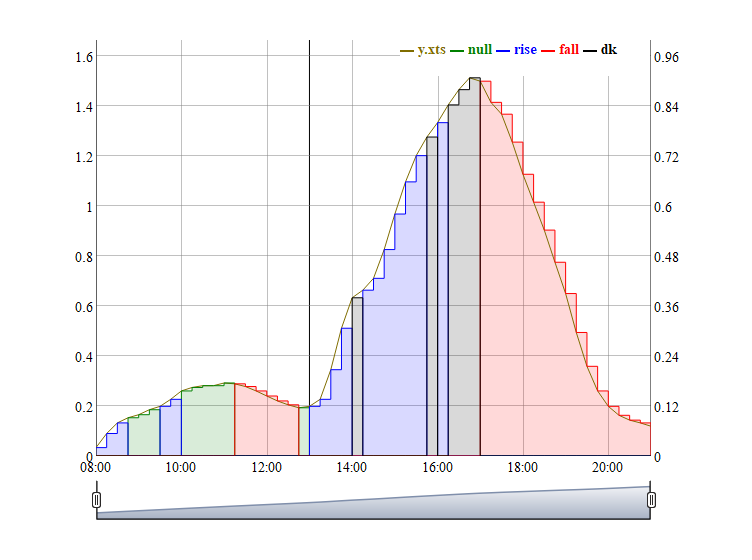<!-- -->

When the valley is deep for both the previous and the next peaks, the
two events were separated.

``` r
plotStorm(r_,198)
```

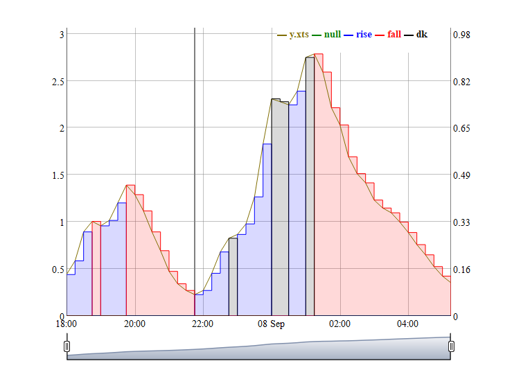<!-- -->

There were situations when these rules were too ambiguous and could lead
to errors, such as incorrectly separating two peaks, or incorrectly
combining two discrete events. Thus, the multi-peak events were also
manually reviewed. Upon review, errors in event delineation were
corrected, as an example follows.

``` r
plotStorm(r_,295)
```

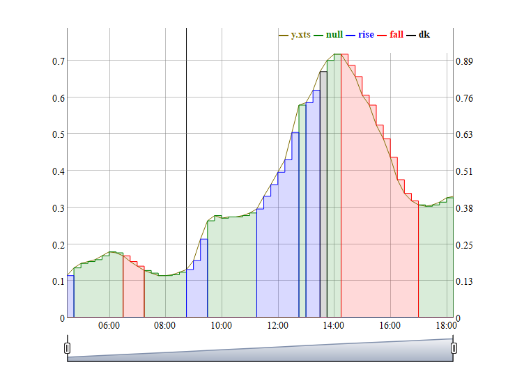<!-- -->

In the example above, the algorithm delineated this event as two storms.
But upon manual review, the first event may be better treated as part of
the rising limb, and the automatic classification result was revised
manually.

From this station, there were 64 events with double peaks. Through the
manual review, seven potential errors were identified and corrected.

## Events with three+ peaks

There are complex events with more than two peaks or more than one
valley between peaks.

``` r
c_ <- subset(r_$value,nevent>1)
str(c_)
```

    ## 'data.frame':    5 obs. of  15 variables:
    ##  $ storm : num  1 94 299 346 455
    ##  $ sub   : num  1 1 1 1 1
    ##  $ iStart: num  624 104884 300760 348620 453511
    ##  $ iEnd  : num  729 104919 300844 348654 453582
    ##  $ npeak : int  6 3 5 3 3
    ##  $ len   : num  106 36 85 35 72
    ##  $ dist  : num  37 10 36 11 23
    ##  $ nevent: int  4 2 2 2 2
    ##  $ run   : int  1 3 26 37 43
    ##  $ jStart: num  2 77 77 155 376
    ##  $ jEnd  : num  45 90 101 168 398
    ##  $ q     : num  0.967 0.565 1.435 0.196 0.42
    ##  $ base  : num  0.1883 0.0733 0.1766 0.0122 0.0901
    ##  $ init  : num  0.0237 0.043 0.0454 0.0173 0.0515
    ##  $ index : num  1 94 299 346 455

In this station, five such storms were identified automatically. The
same classification rules were applied to these valleys as to whether to
separate the adjacent peaks as discrete storm events. But due to the
complexity, these rules were less accurate and all delineations were
manually reviewed and corrected, if appropriate. For example.

``` r
plotStorm(r_,455)
```

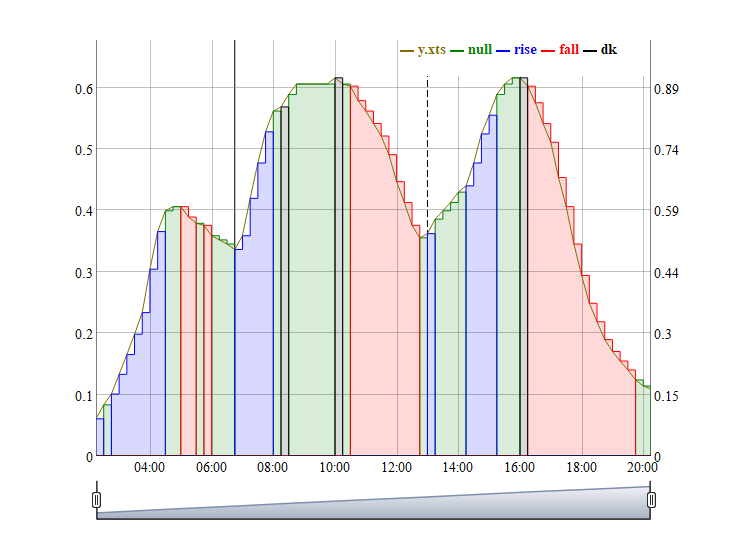<!-- --> Upon manual
review, the third peak is best separated as a discrete event but the
algorithm combined it with the second peak. So I manually corrected the
results.

## Semi-automated procedure

Due to the sensitivity of the algorithm to complex events, a manual
review was conducted to identify and correct delineation errors. The
review results were maintained as a $data.frame$.

``` r
storm_review <- data.frame(station=1,storm=c(295,455),peak1=c(1,2))
```

In the example above, the reviewer identified the storm number and the
valley number within each storm that required correction. The
delineation results are binary: the end of the falling limb or a minor
change within a complex event. Correction thus involves negating the
automated delineation decision. For example, the first peak of storm 295
was changed from an end of the event to not an end of the event.

The following code incorporated the manual review results and identified
all the storm events.

``` r
r1_ <- update_hydrograph(r_,storm_review)
```

    ## station  1 
    ## revision  1 storm 295 n= 1 peak= 1 
    ## revision  2 storm 455 n= 2 peak= 2

``` r
subset(r1_$value,storm==295)
```

    ##       storm sub iStart   iEnd npeak len dist nevent run jStart jEnd         q
    ## 295.1   295   1 297807 297861     2  55   31      1  26     24   48 0.3388569
    ##            base       init index
    ## 295.1 0.1084677 0.06397427   305

``` r
subset(r1_$value,storm==455)
```

    ##       storm sub iStart   iEnd npeak len dist nevent run jStart jEnd         q
    ## 455.1   455   1 453511 453529     1  19    0      1  43    376  383 0.2947787
    ## 455.2   455   2 453529 453554     1  26    0      1  43    384  391 0.5228602
    ## 455.3   455   3 453554 453582     1  29    0      0  43    392  398 0.4092614
    ##             base       init index
    ## 455.1 0.05514678 0.05145021   473
    ## 455.2 0.10297314 0.05145021   474
    ## 455.3 0.10157127 0.05145021   475

Two peaks were combined into storm 295, while storm 455 consisted of
three separate events.

Having identified the storm events, we turned to the remaining periods.
These periods were initially classified as baseflow periods. However,
some high-flow events might still be missed. The following codes
identified those missed events.

``` r
r2_ <- base_hydrograph(r1_,verbose = F)
which(r2_$base$y>0.5)
```

    ## [1]  31 210 338

High flow (above 0.5 m3/s/m2) events were identified in baseflow
periods. These likely represented missed storm events. These periods
should be combined with the nearest storm events. The relevant data were
visualized first.

``` r
plotBase(r2_,210,buffer =10)
```

    ## overlap with baseflow events  210 
    ## overlap with storm events  205 206

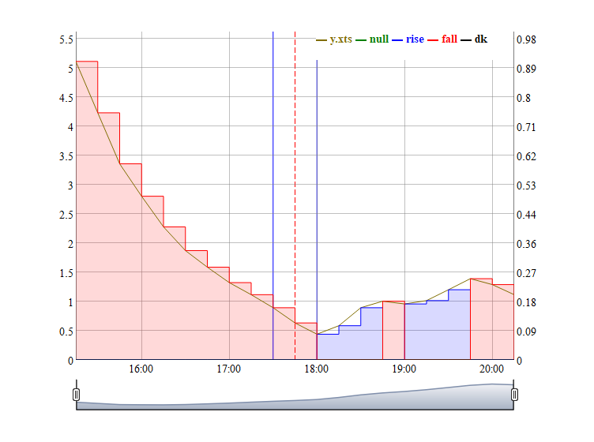<!-- --> The function
returns the baseflow event, and adjacent storm flows events within the
period of the figure. The baseflow event 210 has high flow and was
combined with the falling limb of the previous storm event with an index
of 205. Event 206 represented another storm event and should not be with
the baseflow period.

The manual review of baseflow events was again coded as a $data.frame$.

``` r
breview_ <- data.frame(station=1,base=210,base_2=NA,storm1=205,storm2=NA,rise=0)
```

In the above example, base flow event 210 was combined into storm 205.
The variables $base_2$ and $storm2$ are needed when it’s best to combine
multiple base-flow and storm-flow events.

``` r
r3_ <- update_base_hygh(list(r2_),breview_)
```

    ## station= 1 
    ## append base 210 to falling limb of storm 205

A manual review of the baseflow periods was also incorporated into the
storm delineation. The above code finishes the semi-automated process.
This semi-automated procedure was applied to time series from all USGS
stations to delineate the storm events.
